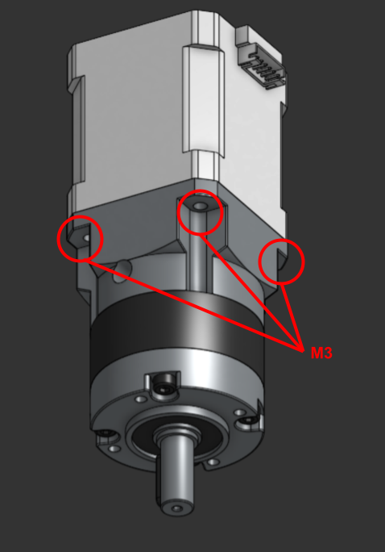
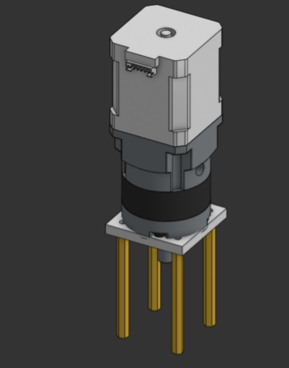
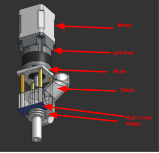
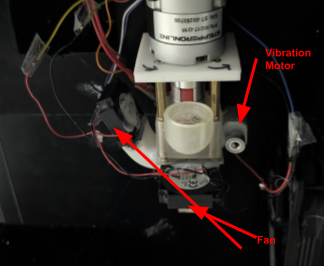
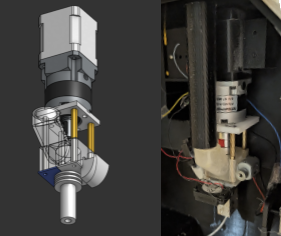
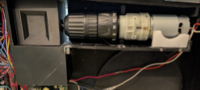
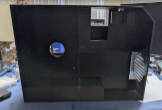
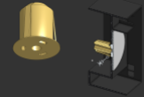
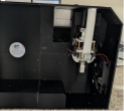

  

# ♻️ Bambu Poop Recycler – Desktop Filament Extruder

Converting **Bambu Poop** (failed prints / support waste) back into **usable filament** using a **screw-based extruder**.  
The goal: a **compact, desktop-friendly recycler** that handles the entire process — **shredding → extruding → spooling** — all from one enclosure.

---

## 📚 Table of Contents

- [🧩 System Overview](#-system-overview)
- [⚡️ Power Distribution](#️-power-distribution)
- [🧵 RAMPS 1.4 Wiring Guide](#-ramps-14-wiring-guide)
- [⚙️ 12 V PSU → Component Wiring](#️-12-v-psu--component-wiring)
- [🪛 Assembly Tips](#-assembly-tips)
- [🧯 Power Safety](#-power-safety)
- [🤖 3D Printing Guide](#-3d-printing-guide)
- [🧰 Assembly](#-assembly)
  - [🔩 Extruder Assembly](#-extruder-assembly)
  - [⚙️ Shredder Assembly](#️-shredder-assembly)
  - [🧱 Main Housing Assembly](#-main-housing-assembly)
  - [🎞️ Spooler Assembly](#-spooler-assembly)
  - [🧩 Final Integration](#-final-integration)

---

## 🧩 System Overview

| Component | Function |
|------------|-----------|
| **Arduino Mega + RAMPS 1.4** | Controls heater, thermistor, fans, vibrator, and 2 stepper drivers (extruder screw + spooler). |
| **Drill Motor + Motor Controller (e.g., DC PWM driver)** | Drives shredder or auger screw for initial granulation. |
| **12 V PSU (≥ 20 A)** | Main power source for heaters, fans, steppers, and motor controller. |
| **Buck Converter (12 V → 5 V)** | Powers ESP32 dashboard and 5 V logic fans. |
| **ESP32** | Monitors Mega’s serial output and serves real-time data on a local webpage. |

---

## ⚡️ Power Distribution

| Source | Destination | Description |
|---------|--------------|--------------|
| **12 V DC PSU (20 A min)** | **RAMPS 1.4 (11 A + 5 A inputs)** | Main power for heater, fans, and steppers |
|  | **DC Motor Controller (for drill motor)** | Supplies high-current 12 V for shredding/auger motor |
|  | **Buck Converter (input)** | Feeds 12 V into buck regulator |
|  | → **5 V Output (from Buck Converter)** | Powers ESP32 + 5 V logic fans |
| **Ground (GND)** | All components common | Connect PSU GND ↔ RAMPS GND ↔ Buck GND ↔ Motor Controller GND ↔ ESP32 GND |

✅ **Tip:** all grounds **must** be common (PSU GND ↔ RAMPS GND ↔ Buck GND ↔ Motor Controller GND ↔ ESP32 GND).

---

## 🧵 RAMPS 1.4 Wiring Guide

| Function | RAMPS Pins | Connected Component | Notes |
|-----------|-------------|---------------------|-------|
| **Heater** | D10 | Extruder heater cartridge | MOSFET output, 12 V |
| **Thermistor (T0)** | T0 (A13) | 100 k NTC thermistor | Connect one leg to T0, one to GND |
| **Stepper A (E0)** | X-driver socket (A_STEP=54, A_DIR=55, A_EN=38) | Extruder stepper | Drives screw |
| **Stepper B (E1)** | Y-driver socket (B_STEP=60, B_DIR=61, B_EN=56) | Spooler stepper | Controls filament winding |
| **Fans (12 V)** | D9 (PWM MOSFET) | 12 V cooling fan | Variable speed based on temp/activity |
| **Fans (5 V)** | D4, D6 | Small logic fans | Driven via MOSFET or transistor boards |
| **Vibrator / Mixer Motor** | D16/D17/D5 → L298N IN1/IN2/ENA | Vibrating base / mixer | PWM controlled |
| **Heat Toggle Button** | A15 | Momentary push button → GND | Toggles heating cycle |
| **Encoder** | D31 (CLK), D33 (DT), D35 (SW) | Rotary encoder | Speed + direction control |
| **ESP32 Link** | TX0 (pin 1) → RX (via 1 k/2 k divider) | ESP32 RX pin | Sends data for web dashboard |
| | RX0 (pin 0) ← TX (3.3 V) | ESP32 TX pin | Optional (disconnect when uploading) |

---

## ⚙️ 12 V PSU → Component Wiring

| Output | Destination | Wire Gauge | Notes |
|---------|-------------|------------|-------|
| +12 V | RAMPS Power Inputs (11 A & 5 A) | 14–16 AWG | Use ferrules or ring terminals |
| +12 V | Drill Motor Controller V+ | 14 AWG | Feeds high-current DC motor |
| +12 V | Buck Converter IN+ | 18 AWG | For ESP32 + 5 V logic |
| GND | Common to all | 14–18 AWG | Must tie all GNDs together |

### Buck Converter
| Input | Output | Use |
|--------|---------|-----|
| 12 V IN + / – | 5 V OUT + / – | Powers ESP32, small 5 V fans and L298N |

### Drill Motor Controller
| Input | Output | Use |
|--------|---------|-----|
| +12 V / GND | M+ / M– | Connects to drill/auger motor |
| PWM / POT / CTRL | Optional | Speed control (manual or logic-level) |

---

## 🪛 Assembly Tips

- **Full assembly guide will me added SOON**
- Keep **heater + thermistor wires** away from **motor leads** to avoid noise.
- Mount the **buck converter** near the ESP32; keep its output wires short.
- Label all 12 V lines before final crimping.
- Always test the **heater MOSFET** and **fan MOSFETs** with a multimeter before loading filament.
- Add a **thermal fuse (250 °C)** inline with the heater block for safety.

---

## 🧯 Power Safety

- Use a **12 V 20 A (240 W) PSU** with built-in short-circuit protection.
- Add a **5 A inline fuse** for the RAMPS input and **10 A fuse** for the motor controller branch.
- Ensure metal enclosures are **earth-grounded**.
- Never leave the extruder unattended while heating.

---
## 🤖 3D Printing Guide

- **Extruder**
  - `extruder - chute.step` *(PLA or Resin)*
  - `extruder - pipe.step` *(PLA)*
  - `fan mount - Part 1.step` *(Resin)*
  - `extruder Copy 1 - Part 1.step` *(PLA or Resin)*
  - `extruder Copy 1 - Part 2.step` *(High Temp Resin)*
  - `extruder Copy 1 - Part 3.step` *(High Temp Resin)*

- **Spooler**
  - `main - Spur gear (170 teeth).step` *(PLA)*
  - `main - Spur gear (30 teeth).step` *(PLA)*
  - `spooler - Part 1.step` *(PLA)*

- **Shredder**
  - `spooler - Part 1.step` *(PLA, 4–5 wall loops recommended)*

- **Main (All PLA)**
  - `main - Motor.step`
  - `main - Part 1.step`
  - `main - Part 4.step`
  - `main - Part 6.step` *(1/4 of Part 1)*
  - `main - Part 7.step` *(2/4 of Part 1)*
  - `main - Part 8.step` *(3/4 of Part 1)*
  - `main - Part 9.step` *(4/4 of Part 1)*
  - `main - motor-holder.step` *(for spooler)*

---

## 🧰 Assembly

This section provides a step-by-step **assembly guide for the entire Bambu Poop Recycler**, broken down into key modules — **Extruder**, **Spooler**, **Shredder**, and **Main Frame**.  
Each subsection includes detailed instructions, part references, and visuals to help you build, wire, and align every component of the system.

Before starting:
- Make sure all 3D-printed and mechanical parts are **cleaned, deburred, and test-fitted**.
- Keep **thread locker, M3/M4 hardware**, and a **soldering iron or crimping tools** nearby.
- Follow the wiring and safety guidelines in earlier sections before powering the system.

---

### 🔩 Extruder Assembly

1. **Attach the Stepper Motor and Planetary Gearbox**  
   Grab your **NEMA stepper motor** and **planetary gearbox**.  
   Use **four M3 screws** to fasten them together as shown in the image below.  

     
   *Figure 1: Stepper motor and planetary gearbox mounted together.*

---

2. **Mount the 3D-Printed Plate**  
   Secure the **3D-printed plate** to the **planetary gearbox** using **M4 screws** as shown below.  

     
   *Figure 2: 3D-printed plate mounted to the gearbox.*

---

3. **Install the Extension Rods**  
   Screw in **four M3 threaded extension rods** (each **57 mm long**) into the plate.  
   Make sure all rods are evenly tightened and parallel.  

     
   *Figure 3: Four M4 rods installed on the plate.*

---

4. **Attach the Chute and Resin Plates**  
   Slide the **chute** into the **M3 extension holes** and align it with the bottom side of the assembly.  
   Then attach the **two resin-printed plates** using **M3 screws**.  
   It’s recommended to print these two plates using a **high-temperature material** (e.g., ABS, ASA, or PA-CF).  

     
   *Figure 4: Chute inserted and resin plates secured.*

---

5. **Install Cooling and Vibration Components**  
   Hot glue the **fans** and **vent channels** onto the sides of the chute,  
   and attach the **vibration motor** to one side as shown below.  

     
   *Figure 5: Fan and vibration motor placement.*

---

6. **Final Extruder Assembly Overview**  
   This is what the completed extruder assembly should look like:  

     
   *Figure 6: Final assembled extruder module.*

---

🧠 **Tips:**
- Use **thread locker (Loctite Blue)** on all metal-to-metal threads.
- Ensure the **gearbox output shaft** rotates freely before connecting the screw.
- Keep **fans oriented** to blow across the chute for optimal cooling.
- Route wiring away from the heater and moving parts.

---

### ⚙️ Shredder Assembly

1. **Prepare the Shredder Blade**  
   Cut a **metal ruler** to the correct length so it fits snugly inside the **3D-printed shredder housing**.  
   Make sure both ends are cleanly trimmed and free of burrs before assembly.  

---

2. **Install the Router Bit**  
   Insert the **router bit** into the side hole of the shredder assembly.  
   Slide it in carefully until it seats fully, then **tighten the drill chuck** to secure it in place.  

---

3. **Attach the Motor Mount**  
   Use the **shredder motor mount** to align the drill motor with the printed housing.  
   Do not glue or bolt it permanently yet — this will later **slide into the main frame** during final assembly.  

---

4. **Final Shredder Assembly Overview**  
   The completed shredder module should look similar to the image below.  
   Ensure the **ruler blade**, **router bit**, and **motor mount** all align properly within the printed frame.  

     
   *Figure 4: Completed shredder assembly.*

---

🧠 **Tip:**
- Double-check that the **router bit spins freely** without wobble before powering it.   

---

### 🧱 Main Housing Assembly

1. **Align the Printed Sections**  
   Gather all **four 3D-printed housing parts**.  
   Lay them out in order — start with the **top-left section**, followed by the **top-right**, then move **downward** as shown in the reference image.  
   Ensure the edges are clean and fit together tightly before gluing.

---

2. **Bond the Housing Sections**  
   Apply **super glue or CA glue** along the connecting seams.  
   Begin by gluing the **top-left section**, then move to the **right side**, and finally **assemble the lower sections**.  
   Make sure each joint is aligned properly before the glue sets.

---

3. **Final Main Housing Overview**  
   Once assembled, check that the full frame sits flat and square.  
   The **shredder** and **extruder modules** will later slide into this housing frame during final assembly.

     
   *Figure 3: Completed main housing ready for module installation.*

---

🧠 **Tips:**
- Lightly sand the joint surfaces before gluing for stronger adhesion.  
- Use **clamps** or **tape** to hold parts in place while the glue cures.  

---

### 🎞️ Spooler Assembly

1. **Insert the Spur Gear**  
   Take the **large spur gear** and insert it **from the back side of the main housing**.  
   Make sure the gear teeth are facing inward and mesh smoothly with the drive gear inside the housing.  
   Rotate it by hand to confirm it spins freely without binding.
---

2. **Attach the Spooler Module**  
   Align the **spooler part** with the front opening of the housing.  
   Gently **press or clip** it into place — it should hold firmly without glue.  
   If you prefer a more permanent connection, you can add a **small drop of super glue** at each corner.

---

3. **Check Alignment and Rotation**  
   Once installed, ensure the spooler gear and main gear rotate smoothly together.  
   The spool should sit centered and spin freely without wobble.

     
   *Figure 3: Completed spooler assembly mounted to the main housing.*

---

🧠 **Tip:**
- If rotation feels stiff, lightly **sand the inner gear edges** or apply a **drop of PTFE lubricant**.  
 

---

### 🧩 Final Integration

1. **Insert the Shredder Assembly**  
   Slide the **shredder assembly** in **from the back side** of the main housing.  
   Align it carefully with the **top opening** so that the chute and blade section fit into their designated slots.  
   Make sure the motor mount sits flush and the assembly can move slightly for final alignment.

     
   *Figure 1: Shredder assembly slid into position from the back.*

---

2. **Install the Extruder Assembly**  
   Next, slide the **extruder assembly** into the front section of the housing.  
   The **stepper motor** should snap or slide into the **mounting clip** integrated into the frame.  
   Double-check that the extruder chute aligns with the shredder output path for smooth material flow.

     
   *Figure 2: Extruder assembly clipped into the front stepper mount.*

---

3. **Verify Module Alignment**  
   With both assemblies in place, check that:
   - The **shredder outlet** aligns directly above the ** hole**.  
   - The **wiring paths** are clear and not pinched between parts.  
   - The **motor shafts** rotate freely without resistance.  

---

🧠 **Tips:** 
- If fitment feels tight, lightly sand the mounting clips or interior guides.  

---

